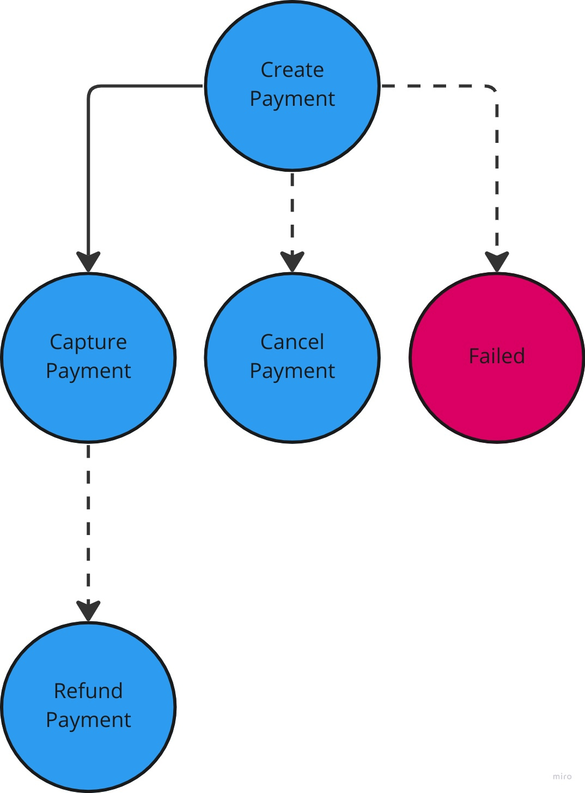

### The above figure is a state transition in the payment process.

* Create payment: Acceptance of payment
* Capture payment: Successful payment
* Refund payment: Refunded payment, if there is a refund
* Cancel payment: Cancel create payment
* Failed: Failed Payment

## Create payment
Create payment ENDPOINT:
```
POST HTTP://localhost:8080/payment/auth
```

HTTP Header:
```
From: dadece5d-a1b9-4335-97b8-4180aa4ef4dd // merchant id
```

Payment request:
```
{
  "id": "43369ead-1205-4259-80ed-c0fa29450aba", // buyer's id account
  "order_id": "1",
  "amount": 55,
  "currency": "RUB",
  "card_number": 444444444444444,
  "card_expiry_month": 12,
  "card_expiry_year": 24,
  "card_security_code": 924
}
```

Responce:
```
{
  "id": "43369ead-1205-4259-80ed-c0fa29450aba", // payment id
  "status": "Approved"
}
```

## Capture payment
Create payment ENDPOINT:
```
POST HTTP://localhost:8080/payment/capture/{id} // auth payment id
```

HTTP Header:
```
From: dadece5d-a1b9-4335-97b8-4180aa4ef4dd // merchant id
```

Paid request:
```
{
  "order_id": "1",
  "payment_id": "0b4e4d2b-bee1-4221-bc68-089d546a795d", // auth payment id
  "amount": 55
}
```

Responce:
```
{
  "id": "e4b63fc5-c156-48c0-9080-7f6bd66b6667", // capture paiment id
  "status": "Successful payment"
}
```

## Refund payment
Create payment ENDPOINT:
```
POST HTTP://localhost:8080/payment/refund/{id} // capture payment id
```

HTTP Header:
```
From: dadece5d-a1b9-4335-97b8-4180aa4ef4dd // merchant id
```

Paid request:
```
{
  "order_id": "1",
  "payment_id": "e4b63fc5-c156-48c0-9080-7f6bd66b6667", // capture payment id
  "amount": 55
}
```

Responce:
```
{
  "id": "067c1909-60cb-4fa4-b52f-6127ddbff4c3",
  "status": "Successful refund"
}
```

## Capture payment
Create payment ENDPOINT:
```
POST HTTP://localhost:8080/payment/cancel/{id} // auth payment id
```

HTTP Header:
```
From: dadece5d-a1b9-4335-97b8-4180aa4ef4dd // merchant id
```

Paid request:
```
{
  "order_id": "1",
  "payment_id": "0b4e4d2b-bee1-4221-bc68-089d546a795d", // auth payment id
  "amount": 55
}
```

Responce:
```
{
  "id": "af75b5fb-1af6-4517-8057-f140fbcac913", // cancel id
  "status": "Successful cancel"
}
```